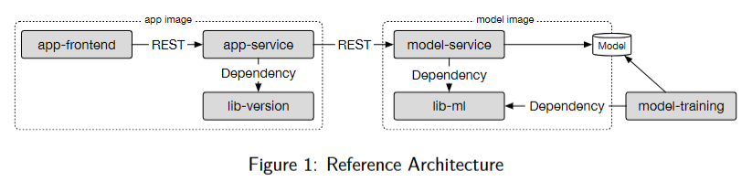

# REMLA 25 Team 5 - Sentiment Analysis App

### **Assignment 1: Versions, Releases, and Containerization.** 

For a quick start, you can run the app using [Docker Compose](#docker-compose).

The whole project contains two docker images, the architecture is taken from the assignment:




- The app image (left) is the web app developed with Flask and Vue. It is responsible for the user interface and the interaction with the user. The app image is built using a Dockerfile located in the `app` directory.
- The model image (right) contains the sentiment analysis model. It is built using a Dockerfile located in the `model` directory. The model image is responsible for loading the model and serving it to the app image via a REST API.
- The images are combined using Docker Compose, using the `docker-compose.yml` file.

The two images are detailed in the next two sections.

## App-service

The Vue frontend can be found in [app-frontend](https://github.com/remla25-team5/app/tree/main/app-frontend) 
and the Flask backend is in [app-backend](https://github.com/remla25-team5/app/tree/main/app-backend).
The API is documented with the OpenAPI standard, and can be found in the docstrings. 

The app image is built using the Dockerfile in root. The environment variables are configured in the .env file, in line with the variables used in the model image.

It uses a multi-stage build to first build the frontend, then it copies the HTML files to the app image. 
It then installs the requirements for the backend, including a tagged release for the lib-version library from github. 

The app image can be built using the following command:

```bash
docker build -t app-service .
```
The app image is run with:

```bash
docker run -p 8080:8080 --env-file=.env app-service 
```

## Model-service

The model service relies on the lib-ml library to encapsulate preprocessing, which is used
both for training and inference. 
Training is done in a [separate repository](https://github.com/remla25-team5/model-training) in a jupyter notebook, and the model is released on github.
The model service downloads the model and the CountVectorizer from the release on github, and caches them in a local directory.

The API is documented with the OpenAPI standard, and can be found in separate YAML files. The default environment variables are in the .env file.

To run the model service, the following command can be used:

```bash
docker build -t model-service .
```

The model service is run with:

```bash
docker run -p 5000:5000 model-service
```

## Docker Compose

The two images are combined using Docker Compose, using the `docker-compose.yml` file in this repository.
The environment variables from the env files are passed to the app and model images.
By default the app image is run on port 8080, and the model image is run on port 5000.

Run with:

```bash
docker-compose up
```
The app can then be accessed at [http://localhost:8080](http://localhost:8080).

### **Assignment 2: Provisioning a Kubernetes Cluster**

The Kubernetes cluster is provisioned using Vagrant and Ansible. The infrastructure consists of one controller node and two worker nodes, all running Ubuntu 24.04.

#### Vagrant Configuration

The `Vagrantfile` located in the `operation` directory defines:
- 1 control plane node (`ctrl`)
- 2 worker nodes (`node-1` and `node-2`)
- A private network with fixed IPs for all nodes (192.168.56.100 for controller)
- Provisioning using Ansible playbooks

#### Ansible Provisioning

The Ansible playbooks are located in the `operation/ansible-provisioning` directory:

- **general.yaml**: Applied to all nodes, handles common setup tasks, such as:
  - SSH key authorization for team members
  - Disabling swap (required for Kubernetes)
  - Common system configuration
  - Etc.

- **ctrl.yaml**: Specific to the controller node:
  - Initializes the Kubernetes control plane with `kubeadm`
  - Sets up kubeconfig for the vagrant user
  - Configures the Pod network with Flannel
  - Etc.

- **node.yaml**: Applied to worker nodes:
  - Configures worker-specific settings
  - Joins nodes to the Kubernetes cluster
  - Etc.

#### Usage Instructions

To provision the Kubernetes cluster:

```bash
# Navigate to the operation directory
cd operation

# Start the VMs and provision with Ansible
vagrant up

# To SSH into the controller node:
vagrant ssh ctrl

# To SSH into a worker node (replace n with node number):
vagrant ssh node-n

# To destroy the VMs when done:
vagrant destroy -f
```

Once provisioned, the Kubernetes cluster will be ready to deploy the sentiment analysis application.

If you only want to provision after running `vagrant up`, you can run the following command:

```bash
vagrant provision
```

## Repositories

Links to the repositories used in this project:

- [model-service](https://github.com/remla25-team5/model-service)
- [lib-ml](https://github.com/remla25-team5/lib-ml)
- [operation](https://github.com/remla25-team5/operation)
- [app](https://github.com/remla25-team5/app)
- [model-training](https://github.com/remla25-team5/model-training)
- [lib-version](https://github.com/remla25-team5/lib-version)

## Current status

✅ Assignment 1

✅ Assignment 2

### Use of Generative AI

We used generative AI in the following ways:

- **model-training**: For model-training, Gemini was used to avoid doing repetitive tasks, such as duplicating code with small variations for the training of the classifiers.
- **model-service**: For model-service, ChatGPT was used to understand what Dockerfiles and release.yml files are, and what they should contain. Copilot was used to help with making environment variables that are used in the model_utils.py and service.py files. It was also used to speed up repetitive tasks, like downloading the CountVectorizer model the same way that the trained model is downloaded. It was also used to help with writing the README.md file.
- **lib-ml**: In lib-ml, Gemini was used to help determine the needed dependencies for the pyproject.toml file.
- **app**: For the frontend, ChatGPT was only used for trivial and repetitive tasks. Examples include: adding try/catch blocks to code, adding console.log statements to code and defining datatypes in TypeScript as specified by me etc.
- **operation**: For operation, GitHub Copilot was used to help with writing the README.md file. It was also used to help with understanding how `Vagrantfile works`, especially in combination with Ansible. For steps 1 - 5, it was used to help with understanding the setup of the Ansible `general.yaml` playbook. For steps 11-15 I used ChatGPT to enhance my personal understanding of how to specify things in the .yaml file, I read the documentation and then challenged my belief with ChatGPT to make sure i didn't miss any subtleties.