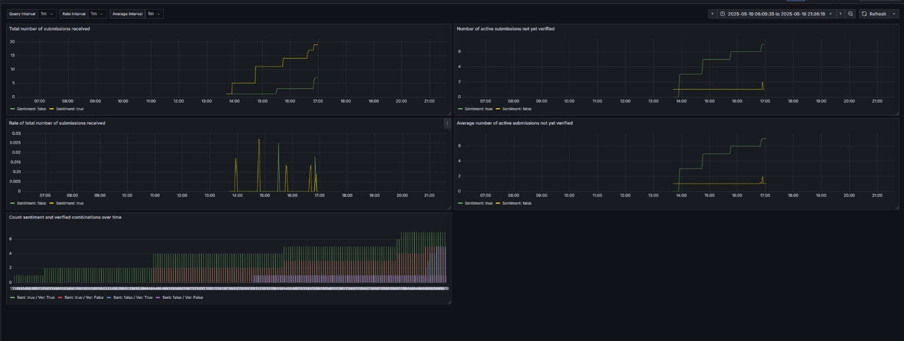
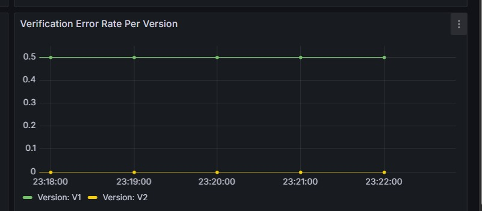

# Continuous Experimentation: Adding "Neutral" Sentiment to the Review App

## 1. Background

In the original implementation of our review application, the backend performs sentiment analysis and returns either `positive` or `negative`. This result is shown to users, who can verify whether they agree with the prediction. This feedback helps us improve the sentiment model.

## 2. Implemented Change

We modified both the backend and frontend to introduce a third sentiment category: `neutral`.

- **Backend Change**: The sentiment classifier now returns one of `positive`, `neutral`, or `negative`. If model confidence is > 0.8 → `positive`, < 0.2 → `negative`, otherwise → `neutral`.
- **Frontend Change**: Updated the UI to display the `neutral` sentiment visually and handle it as a third possible outcome.
- **API Change**: `/api/submit` now returns `sentiment_label` as a string (`"positive"`, `"neutral"`, or `"negative"`), instead of a boolean.

## 3. Hypothesis

**Hypothesis**: Adding a `neutral` sentiment class increases the percentage of users who agree with the model's sentiment prediction.

This hypothesis is **falsifiable**. If users are more satisfied with a three-class sentiment model, we expect them to mark predictions as correct more often.

## 4. Experiment Setup

We deployed two versions of the service:

- **Version A (Control)**: Original 2-class model (positive/negative).
- **Version B (Experimental)**: Updated 3-class model (positive/neutral/negative).

Users are randomly routed to one of the two versions.

Both versions expose the same API:

- `POST /api/submit` for submitting a review
- `POST /api/verify` for confirming the sentiment

## 5. Evaluation Metric

We measure:

**User Agreement Rate**

This is the percentage of predictions users confirm as correct via `/api/verify`.

```text
user_agreement_rate = (number of verifications marked correct) / (total verifications)
```


## 6. Data and Visualization

A **Grafana dashboard** is used to visualize experiment data and monitor impact in real time. The dashboard displays:

- **Agreement rates** over time for each version (A vs. B)
- **Breakdown of sentiment categories**: positive / negative / neutral (only for Version B)
- **Submission and verification counts** per version
- **Statistical test results** to support decision-making

These visualizations help determine whether the experimental version shows meaningful improvement.

### Example Dashboard



### Agreement Rate Comparison



## 7. Decision Process

We compare the agreement rates between the control (Version A) and the experiment (Version B) using a **two-proportion z-test** to assess statistical significance.

- **Null Hypothesis (H₀)**: There is no difference in agreement rates between Version A and Version B (i.e., Version B’s agreement rate is less than or equal to Version A’s).
- **Alternative Hypothesis (H₁)**: The agreement rate of Version B is **different** from that of Version A.

If this initial test suggests a statistically significant difference, we follow up with a **one-tailed test** to determine whether Version B’s agreement rate is actually **higher** than Version A’s.

### Outcome

If we encounter p-values below 0.05 and that this new version has a higher agreement rate, then we conclude there is statistical significant difference and the new version should be rolled out to all users.
