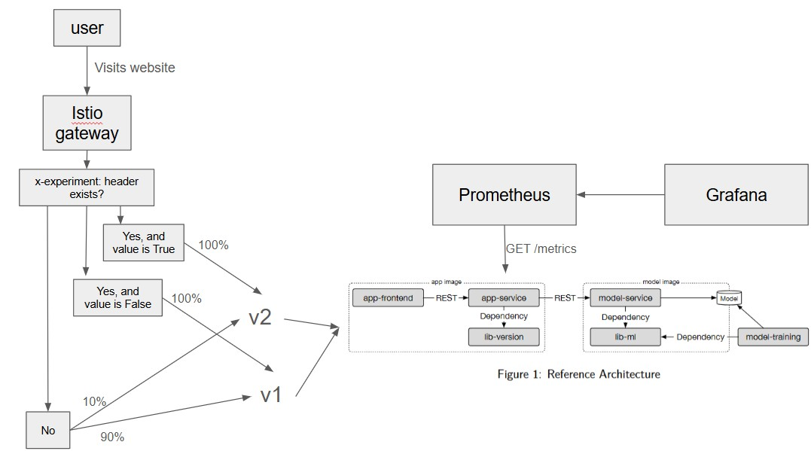

# Sentiment Analysis App - Local Architecture

This document describes the local architecture of the Sentiment Analysis application, as depicted in the diagram below.

## 🏗️ Overview

The user first sends a request to our website, this is picked up by Istio as shown in the diagram. Istio will check if the x-experiment header exists. 

If not, the user has 90% chance to visit our v1 website, and a 10% chance to visit the v2 version which includes our experiment. 

If the header does exist and contains the True value, then the user is visiting the v2 version with certainty. On the other hand, if it's False, the user is visiting the v1 version with certainty. 

At this point the "app-frontend" is sent to the user by the "app-service". 
The "app-frontend" requests versioning information which is delivered by "lib-version" and "lib-ml". 

From this frontend the user is able to interact with the "model-service" through the "app-service" and get sentiment predictions based on the reviews submitted. 
Following this, the user is able to verify correct predictions which are again sent to the backend.
