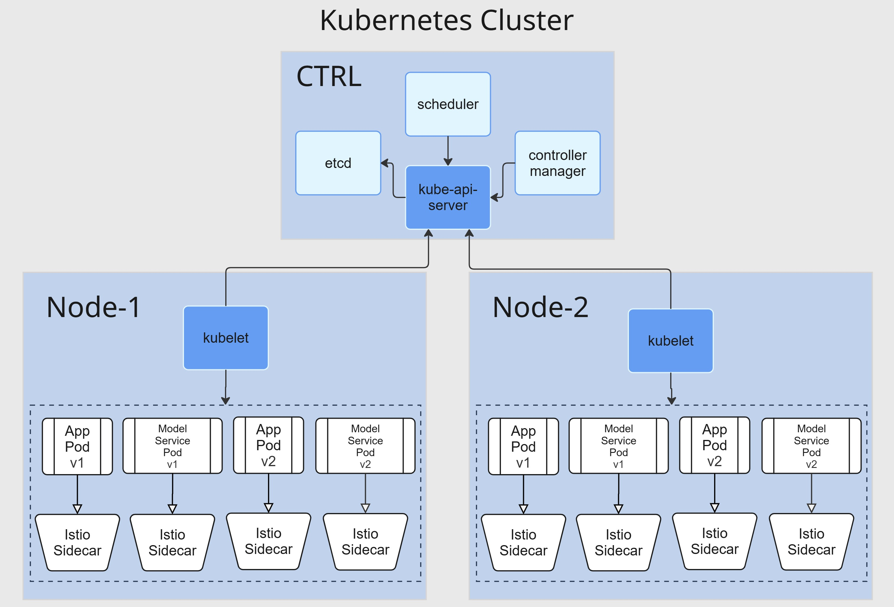

# Sentiment Analysis App Deployment

## Kubernetes Cluster Architecture

Our deployment is orchestrated using a Kubernetes cluster consisting of a centralized control plane and two worker nodes. A description of the components of the architecture is as follows:

### Control Plane (CTRL)
The control plane manages the cluster and includes the following key components:

- **kube-apiserver**: Serves as the front-end of the Kubernetes control plane, handling all REST requests from clients and nodes.

- **scheduler**: Responsible for assigning pods to nodes based on resource availability and scheduling policies.

- **controller-manager**: Maintains the desired state of the cluster by running various controller loops.

- **etcd**: A highly available key-value store used as Kubernetes’ backing store for all cluster data.

### Worker Nodes (Node-1 and Node-2)
Each node runs:

- **kubelet**: The primary node agent that communicates with the control plane to manage pod lifecycle and ensure containers are running as expected.

Each node hosts multiple Pods, specifically:

- **App Pod**: Contains the frontend application services.

- **Model Service Pod**: Contains the ML model services.

Each pod is accompanied by an **Istio Sidecar Proxy**, automatically injected by Istio, to enable service mesh capabilities like traffic routing.

### Istio Service Mesh

#### Local Architecture

The Sentiment Analysis application is structured as a microservices architecture deployed on Kubernetes with Istio for service mesh capabilities. This section provides an overview of the deployment structure and data flow.

#### Traffic Flow Overview

1. The user visits the website and sends a request to our application.
2. Istio's ingress gateway intercepts this traffic and applies routing rules:
   - If the `x-experiment` header is present:
     - Header value `true`: Routes to v2 version (100%)
     - Header value `false`: Routes to v1 version (100%)
   - If the header is not present:
     - 90% of traffic is routed to v1 version
     - 10% of traffic is routed to v2 version (canary deployment)

3. The "app-service" delivers the appropriate "app-frontend" version to the user.
4. The frontend requests versioning information from "lib-version".
5. Users interact with the frontend to submit text for sentiment analysis.
6. The frontend communicates with the "model-service" through the "app-service".
7. The "model-service" processes the text and returns sentiment predictions.
8. Users can verify the correctness of predictions, sending feedback to the backend.

### Deployment Versions
- **v1**: Standard version of the application
- **v2**: Experimental version with additional features

### Monitoring and Observability
- **Prometheus**: Collects metrics from the application and infrastructure
- **Grafana**: Provides dashboards for visualization of metrics
- **Kiali**: Visualizes the service mesh and traffic flow
- **Jaeger**: Distributed tracing for request flows

### Istio Features Implemented
1. **Canary Deployment**: 90/10 traffic split between v1 and v2 when no headers are present
2. **Header-Based Routing**: Using `x-experiment` header for sticky sessions
3. **Rate Limiting**: Per-user rate limiting on API endpoints (10 requests per minute)
4. **Traffic Visualization**: Through Kiali dashboard
5. **Distributed Tracing**: Through Jaeger integration

## Experiment Design

Our experimental design leverages Istio's traffic management capabilities to implement:

1. **A/B Testing**: Comparing user experience and performance between v1 and v2
2. **Canary Releases**: Gradual exposure of new features to a small percentage of users
3. **User-Specific Routing**: Developers can test specific versions using headers

This setup allows us to:
- Gather metrics on both versions simultaneously
- Compare performance in production conditions
- Quickly roll back if issues are detected
- Analyze user behavior differences between versions

## Additional Resources

For implementation details, refer to these repositories:
- Main configuration and Helm charts: [operation repository](https://github.com/remla25-team5/operation)
- App frontend and service implementation: [app repository](https://github.com/remla25-team5/app)
- Model service: [model-service repository](https://github.com/remla25-team5/model-service)