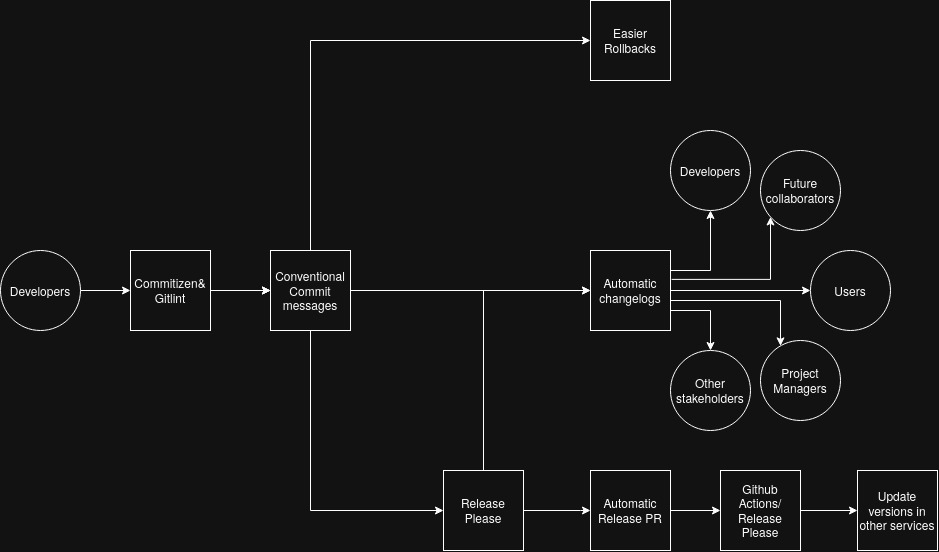

# Extension Proposal

## Shortcomings

We have implemented automatic versioning from assignment 1, however this still suffers from a few problems. Currently, releasing is automated with github workflows across the organization and the versions are automatically created upon push to main. 

However, the Minor and Major versions are still manual, plus our commit history does not allow easy tracking of what features have been completed in what versions nor does it allow automatic changelog creation. This all makes it hard to communicate progress with users and makes it harder for collaborators to know what to work on. Rolling back to a previous version is also tedious, as the commits do not precisely track features or correlate to semantic versions. 

On top of this, the model version is specified in an .env file, which is still at 0.0.1, even though we are currently at v0.0.6. Thus tracking versions of the other services is a problem. The app service makes API requests to model service, where the model service's latest version is deployed. If either makes breaking changes, the other one would have to be adjusted. This is possible with manual version bumps, however it is more error prone.

## Solution

We came up with an extension to fix these problems based on [Conventional Commits](https://www.conventionalcommits.org/en/v1.0.0/#summary) and [Release Please](https://github.com/googleapis/release-please). 

Conventional Commits standardizes commit messages to have a cleaner overview enabling:
> - Automatically generating CHANGELOGs.
> - Automatically determining a semantic version bump (based on the types of commits landed).
> - Communicating the nature of changes to teammates, the public, and other stakeholders.
> - Triggering build and publish processes.
> - Making it easier for people to contribute to your projects, by allowing them to explore a more structured commit history.

Building on top of conventional commits, Release Please creates automatic release PRs that keep up to date. Here, we the changelogs are filled with the information from the more structured commits. We would benefit from this as our releases have been quite information sparse.

[Commitizen](https://commitizen-tools.github.io/commitizen/) could also help write the commit messages to keep them structured and [Gitling](https://github.com/jorisroovers/gitlint) or [any other tool](https://www.conventionalcommits.org/en/about/) recommended by Conventional Commits could work for linting commit messages. This would help us deliver fast sustainably.

Within this workflow we could also integrate automatically updating the model version (default update on patch or minor, require approval on major). Potentially this could be included in the commit message when the model is updated, and other services could be updated based on that. 
All together this would automate all releases, making it less error prone.

Additionally this would allow better communication to stakeholders and within the team, people could get up to date faster. Rollbacks would be easier thanks to the commits being more structured and attributed to a release. 

## Measuring improvement

To measure the affect, we could track the missing or incosistent version tags before and after adopting this way of working. Could also track missing or lacking changelogs, commit messages not linked to a feature and. In addition, rollback success rate or mean time to recovery could also be measured. 

However the big picture goal is to deliver value, so it is also important to measure with conventional metrics for productivity such as DORA or user satisfaction or cost of development. 

## General Applicability

This extension is widely generalisable beyond this project, and we believe it would be an improvement to most. It improves traceability, makes releasing even less error-prone, and enables further automation. 

## Some resources

Keep a changelog: https://keepachangelog.com/en/1.0.0/
Conventional Commits: https://www.conventionalcommits.org/en/v1.0.0/
Release Please: https://github.com/googleapis/release-please

Blog 1: https://ferrishall.dev/automating-github-releases-with-release-please
Blog 2: https://www.amarjanica.com/automate-github-releases-with-release-please/
