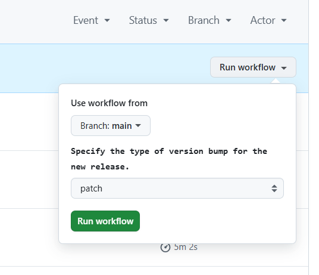
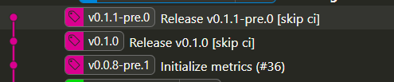
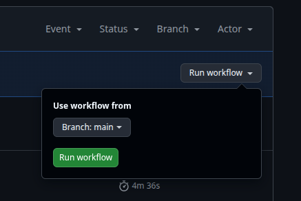
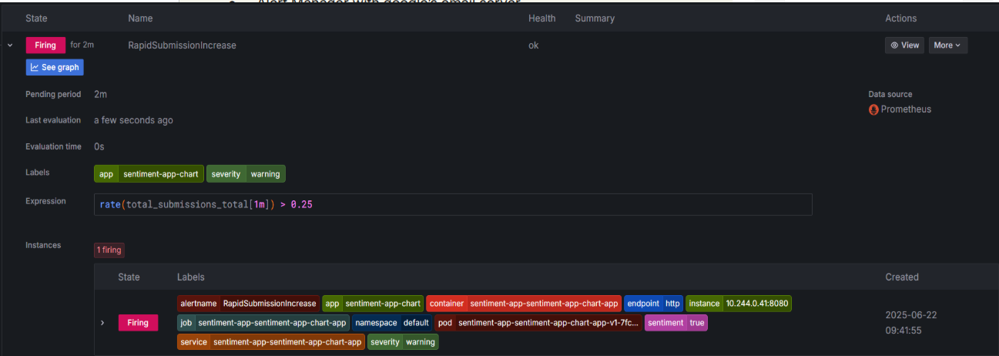
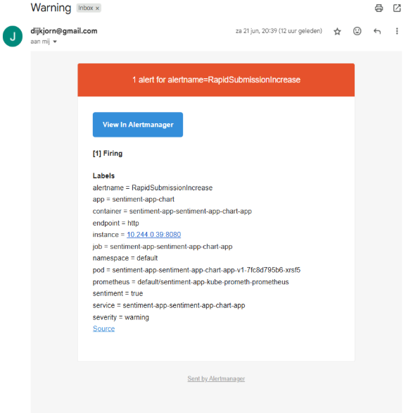
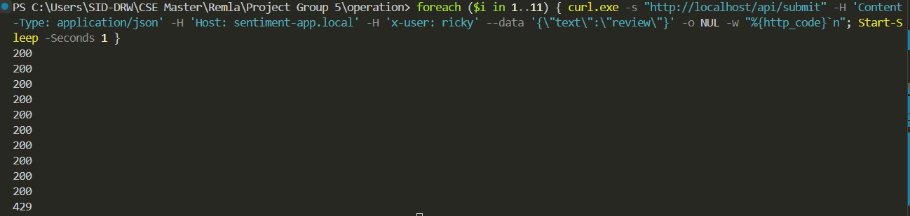

# Grade helper

This document points out per assignment why/how requirements were implemented to make the grading process easier!

For each rubric we mark the attained level with a ✅


## Assignment 1

### Automated Release Process

#### Good ✅

Versioning is done in the workflows of each repository. Each repo has a delivery and a deployment workflow
- Delivery will add a pre-release on every push to main. Automatically incremented every push.
- Deployment uses a workflow dispatch button in the actions tab, where you can define if you want to increase a patch, minor or major version. This makes an empty commit for the official release and then a new commit for the pre release of the next stable release. The images show how this looks with tags and the workflow dispatch button.



 
#### Excellent ✅

- Our released container images support amd64 and arm64 architectures, verify this by running 

`docker buildx imagetools inspect ghcr.io/remla25-team5/model-service:latest
`

and

`docker buildx imagetools inspect ghcr.io/remla25-team5/app:latest
`


- Multiple stage dockerfile:

Go to `https://github.com/remla25-team5/app/blob/main/Dockerfile`


- Multiple versions of the same pre-release:

Go to `https://github.com/remla25-team5/app/actions/workflows/deployment.yml` and run the workflow to verify it





### Software Reuse in Libraries

#### Excellent ✅

- The model is not part of the container image, i.e., it can be updated without creating a new image
by refering to a specific model version that is downloaded on-start

Go to `https://github.com/remla25-team5/model-service/blob/main/.env` to verify we link to the model

- A local cache is used so the model is not just downloaded on every container start

Go to `https://github.com/remla25-team5/model-service/blob/main/model_service/model_utils.py` which handles the caching


### Exposing a Model via REST

#### Good 

- An ENV variable defines the DNS name and port of the model-service.

Check `https://github.com/remla25-team5/app/blob/main/.env`


- All server endpoints have a well-defined API definition that follows the Open API Specification,
and documents at least a summary, the parameters, and the response

Check `https://github.com/remla25-team5/app/blob/main/app-service/app.py`

#### Excellent ✅

- The listening port of the model-service can be configured through an ENV variable

Check `https://github.com/remla25-team5/app/blob/main/.env`

and 

`https://github.com/remla25-team5/app/blob/main/app-service/app.py`


### Docker Compose Operation


#### Good
- The Docker compose file uses a volume mapping, a port mapping, and an environment variable.

Verify this at `https://github.com/remla25-team5/operation/blob/main/docker-compose.yml`

- The compose file works with the same images as the final Kubernetes deployment does

Verify at `https://github.com/remla25-team5/operation/blob/main/sentiment-app-chart/values.yaml`

#### Excellent ✅

- Services have a restart policy.
- The deployment contains an example of a Docker secret.
- The deployment uses an environment file, e.g., to configure names/versions of images


Verify it at `https://github.com/remla25-team5/operation/blob/main/docker-compose.yml`


## Assignment 2


## Assignment 3

### Kubernetes Usage

#### Excellent ✅

- All VMs mount the same shared VirtualBox folder as /mnt/shared into the VM.


- The deployed application mounts this path as a hostPath Volume into at least one Deployment

Check `https://github.com/remla25-team5/operation/blob/main/Vagrantfile`

and

`https://github.com/remla25-team5/operation/blob/main/sentiment-app-chart/templates/app-deployment.yaml`

for both


### Helm Installation

#### Good 


- The chart has a values.xml and allows changing the (DNS) service name of the model service

Check `https://github.com/remla25-team5/operation/blob/main/sentiment-app-chart/values.yaml`

#### Excellent ✅

- The Helm chart can be installed more than once into the same cluster. Grafana and promeheus however do not pick up both instances, so to check this install the charts without monitoring:
```bash
helm install sentiment-app ./sentiment-app-chart --set istioEnabled=false
helm install sentiment-app-test ./sentiment-app-chart --set istioEnabled=false
```


### App Monitoring

#### Excellent ✅

- An AlertManager is configured with at least one non-trivial PrometheusRule .

Check `https://github.com/remla25-team5/operation/blob/main/sentiment-app-chart/templates/alert-manager.yaml`


To trigger the alert as in the picture below, you need to spam the submission button in our frontend to trigger it (can take a long time). You can also use a command to send many requests, an example for powershell is down below:
```bash
foreach ($i in 1..120) { curl.exe -s -o NUL 'http://localhost/api/submit' -H 'Content-Type: application/json' -H 'Host: sentiment-app.local' --data-raw '{\"text\":\"review\"}'; Write-Host "Sent request #$i of 120"; Start-Sleep -Seconds 2 }
```




- A corresponding Alert is raised in any type of channel (e.g., via email).

Also `https://github.com/remla25-team5/operation/blob/main/sentiment-app-chart/templates/alert-manager.yaml`

- The deployment files and the source code must not contain credentials

Secret configured at `https://github.com/remla25-team5/operation/blob/main/sentiment-app-chart/templates/gmail-secret.yaml`


### Grafana

#### Excellent ✅

The Grafana dashboard is automatically installed, e.g., through a ConfigMap

If you want data for the histogram, you actually have to make submissions, the other ones are initiallly filled with zero values.

Check `https://github.com/remla25-team5/operation/blob/main/sentiment-app-chart/templates/grafana-dashboard-configmap.yaml`


## Assignment 4

Just run the README for assignment 4 in our operations repo and all requirements should be easily verifiable.

## Assignment 5

### Traffic management 

#### Excellent ✅

- The project implements Sticky Sessions, i.e., requests from the same origin have a stable routing. 

Check `https://github.com/remla25-team5/operation/blob/main/sentiment-app-chart/templates/app-virtualservice.yaml`

### Additional Use Case

#### Excellent ✅

We added a neutral sentiment on the `feature-neutral-option` branch in `https://github.com/remla25-team5/app`

same branch exists in `https://github.com/remla25-team5/model-service`


### Continuous Experimentation

#### Excellent ✅

The documentation explains the decision process for accepting or rejecting the experiment in details,
ie.g., which criteria is used and how the available dashboard supports the decision

Check `https://github.com/remla25-team5/operation/blob/main/docs/continuous-experimentation.md`

You can say "I like the food" to trigger a positive sentiment
You can input "I do not know" will yield the neutral sentiment
You can input "The food is horrible" to trigger a negative sentiment

Rate limitting was also done, this can be seen by doing the following command in powershell or something similar in bash:
```bash
foreach ($i in 1..11) { curl.exe -s "http://localhost/api/submit" -H 'Content-Type: application/json' -H 'Host: sentiment-app.local' -H 'x-user: ricky' --data '{\"text\":\"review\"}' -o NUL -w "%{http_code}`n"; Start-Sleep -Seconds 1 }
```
After 10 requests with the same user in the x-user field have been sent you can see that the following request is rejected:



### Deployment Documentation

#### Excellent ✅

- The documentation is visually appealing and clear.
- A new team member could contribute in a design discussion after studying the documentation


Check `https://github.com/remla25-team5/operation/blob/main/docs/deployment.md`

### Extension Proposal

#### Excellent ✅

- The presented extension is general in nature and applicable beyond the concrete project.
- The presented extension clearly overcomes the described shortcoming.

Check `https://github.com/remla25-team5/operation/blob/main/docs/extension.md`